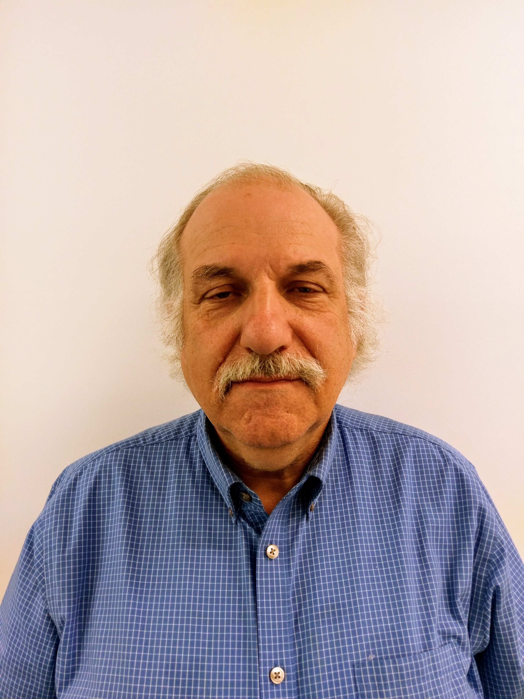
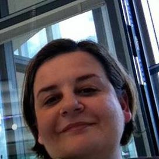
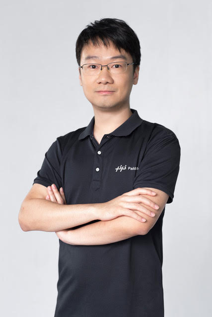
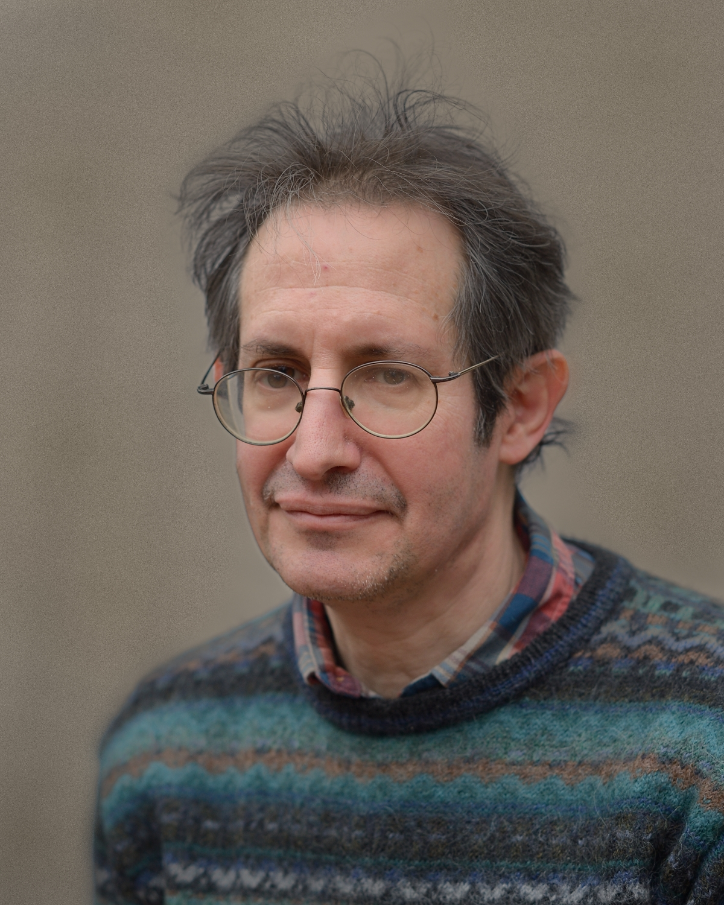

# T1: A Gentle Introduction to Deep Nets and Opportunities for the Future

<h1>Materials for ACL-2022 tutorial T1: <a href="https://www.2022.aclweb.org/tutorials">T1: A Gentle Introduction to Deep Nets and Opportunities for the Future</a></h1>

<h2>Abstract</h2>
The first half of this tutorial will make deep nets more accessible to a broader audience, following “Deep Nets for Poets” and “A Gentle Introduction to Fine-Tuning.” We will also introduce, GFT (general fine tuning), a little language for fine tuning deep nets with short (one line) programs that are as easy to code as regression in statistics packages such as R using glm (general linear models).  Based on the success of these methods on a number of  benchmarks, one might come away with the impression that deep nets are all we need. However, we believe the glass is half-full: while there is much that can be done with deep nets, there is always more to do.  The second half of this tutorial will discuss some of these opportunities

Quick Links:
<ol>
<li>Videos 📽️ <ol>
	<li>📽️ <a href="https://youtu.be/IKjx38AV4bo">10 minute TEASER (for both halves)</a></li>
	<li>🆕📽️  <a href="https://youtu.be/fWS-pgKYE_o">First half (1 hour 16 minutes) UNABRIDGED</a> (YouTube);
<a href="https://www.bilibili.com/video/BV1Y54y1Z7H6?spm_id_from=444.41.list.card_archive.click"> mirror of above </a> (Bilibili)
</li>
	</ol></li>
<li><a href="https://github.com/kwchurch/gft">gft code</a></li>
<li><a href="papers/1.pdf">paper</a></li>
<li>Slides<ol>
		   <li><a href="slides/ACL-2022_tutorial_part_AB_V7.pdf">pdf</a></li>
  		   <li><a href="slides/ACL-2022_tutorial_slides_part_A">3 pptx files</a> and <a href="slides/ACL-2022_tutorial_slides_part_B">1 more pptx file</a></li>
		   </ol></li>
</ol>

<table><tr><th>Part A: Half Full</th><th>Part B: Half Empty</th></tr>
    <tr>                 <td> <table><tr><td></td></tr><tr><td>Ken Church</td></tr><tr><td>Baidu, USA</td></tr></table></td>
		    	 <td> <table><tr><td> </td></tr><tr><td>Valia Kordoni</td></tr><tr><td>Humboldt-Universitaet zu Berlin, Germany</td></tr></table></td></tr>
    <tr> 
		    	 <td><table><tr><td> </td></tr><tr><td>Yanjun Ma</td></tr></tr><tr><td>Baidu, China</td></tr></table></td>
			 <td><table><tr><td> </td></tr><tr><td>Gary Marcus</td></tr><tr><td>Robust.AI</td></tr></table></td></tr>
    <tr>		 <td><table><tr><td> </td></tr><tr><td>Zeyu Chen</td></tr></tr><tr><td>Baidu, China</td></tr></table></td>
			 <td><table><tr><td> </td></tr><tr><td>Ernest Davis</td></tr></tr><tr><td>New York University</td></tr></table></td></tr></table>
			 
			 
			 

